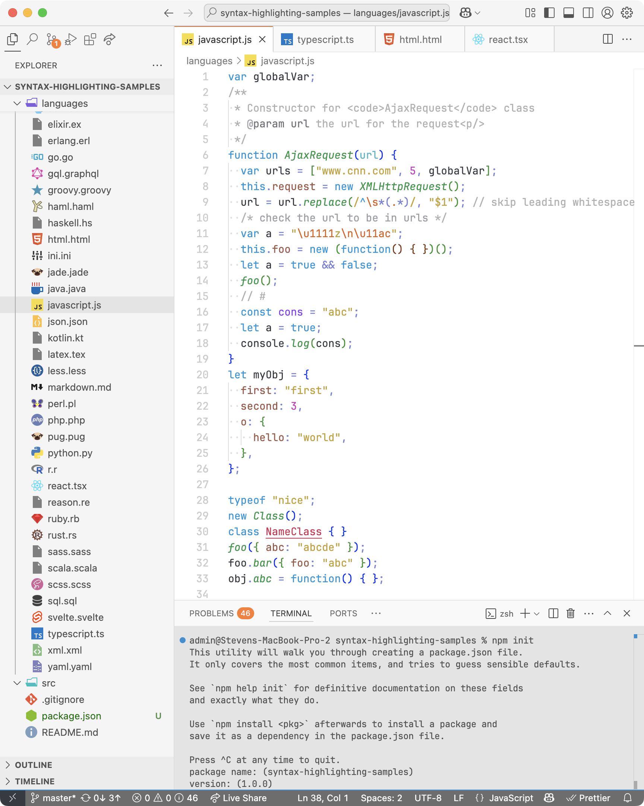

# Walloco - light color theme for VS Code

Originally based on [Bluloco Light Theme](https://github.com/uloco/theme-bluloco-light/tree/main).

## Screenshots

### Javascript

### TypeScript

### HTML

### React TSX

